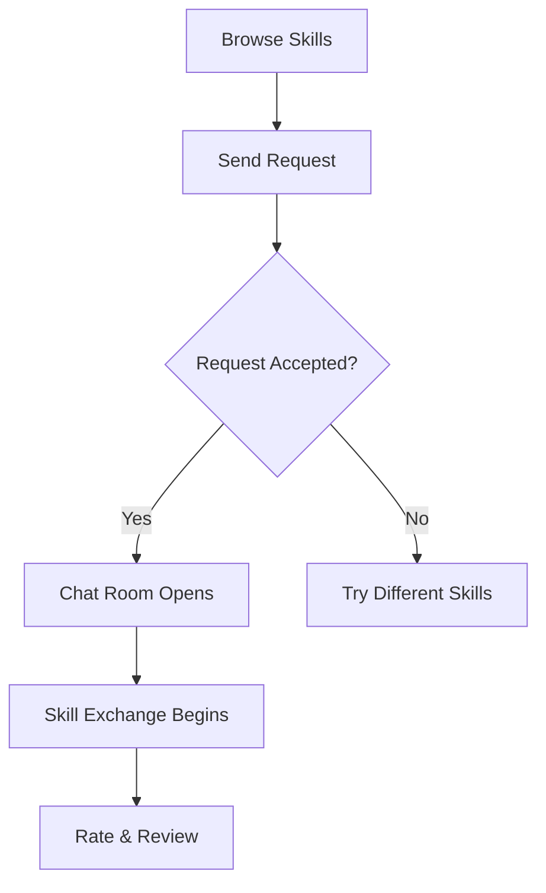

# 🔄 SkillXChange – A Skill-Swapping Platform

<p align="center">
  <em>Exchange Skills. Learn Together. Grow Together.</em>
</p>

<p align="center">
  
  
  
  
</p>

<p align="center">
  <a href="https://skillxchanged.netlify.app/" target="_blank">
    
  </a>
</p>

---

## 📖 Table of Contents

- [Overview](#-overview)
- [Key Features](#-key-features)
- [Tech Stack](#-tech-stack)
- [Getting Started](#-getting-started)
- [How It Works](#-how-it-works)
- [Screenshots](#-screenshots)
- [Team](#-team)

---

## 🌐 Overview

**SkillXChange** is a revolutionary web platform that facilitates **skill bartering** — enabling users to exchange expertise and services without monetary transactions. Whether you're a developer wanting to learn design, or a chef looking to improve your photography, SkillXChange connects you with like-minded individuals for mutually beneficial skill exchanges.

### 🎯 Mission
To create a collaborative learning ecosystem where knowledge and skills are shared freely, fostering personal growth and community building through peer-to-peer education.

---

## ✨ Key Features

### 🔐 **Authentication & Security**
- Secure Firebase authentication with email/password
- Protected routes and user session management
- Admin access control with UID whitelisting

### 🎯 **Smart Skill Matching**
- Intelligent algorithm to match users based on complementary skills
- Browse and discover skills offered by community members
- Send and receive skill exchange requests

### 💬 **Real-time Communication**
- Live chat system for matched users
- Dedicated chat rooms for each skill exchange
- Message history and timestamps

### 🧭 **Intuitive Navigation**
- Dynamic routing based on user status
- Responsive design for all devices
- Context-aware navigation bar

### 🛠️ **Admin Dashboard**
- Comprehensive user management
- Exchange monitoring and analytics
- Report handling and moderation tools

---

## 🧰 Tech Stack

### Frontend Technologies
```
⚛️  React.js        - Component-based UI framework
⚡  Vite.js         - Lightning-fast build tool
🎨  Tailwind CSS    - Utility-first CSS framework
🔥  Firebase Auth   - Authentication service
```

### Backend & Database
```
🔥  Firebase Firestore  - NoSQL document database
☁️  Firebase Hosting    - Web hosting service
🛡️  Firebase Security   - Database security rules
```

---

## 🚀 Getting Started

### Prerequisites
- Node.js (v16 or higher)
- npm or yarn package manager
- Firebase project with Firestore enabled

### Installation

1. **Clone the repository**
   ```bash
   git clone https://github.com/verma07ansh/SkillXChange.git
   cd SkillXChange
   ```

2. **Install dependencies**
   ```bash
   npm install
   ```

3. **Environment Setup**
   Create a `.env` file in the root directory:
   ```env
   VITE_FIREBASE_API_KEY=your_api_key
   VITE_FIREBASE_AUTH_DOMAIN=your_auth_domain
   VITE_FIREBASE_PROJECT_ID=your_project_id
   VITE_FIREBASE_STORAGE_BUCKET=your_storage_bucket
   VITE_FIREBASE_MESSAGING_SENDER_ID=your_sender_id
   VITE_FIREBASE_APP_ID=your_app_id
   ```

4. **Start the development server**
   ```bash
   npm run dev
   ```

5. **Open your browser**
   Navigate to `http://localhost:5173`

---

## 🔄 How It Works

### User Journey

#### 🆕 **New Users**
1. **Sign Up** → Create account with email/password
2. **Profile Setup** → Complete name, skills, and interests
3. **Browse Skills** → Discover what others are offering
4. **Make Connections** → Send skill exchange requests

#### 🔄 **Returning Users**
1. **Login** → Secure authentication
2. **Dashboard** → View active exchanges and requests
3. **Chat** → Communicate with matched users
4. **Manage** → Track ongoing skill swaps


### Skill Exchange Process



---

## 📸 Screenshots

### Platform Overview (Landing Page)


### User Dashboard (Profile Page)


### Skill Matching Interface


### Real-time Chat System


### Admin Dashboard


---

## 👥 Team

Meet the talented developers behind SkillXChange:

<table>
  <tr>
  <td align="center">
      <strong>Ansh Verma</strong><br>
      <a href="https://github.com/verma07ansh">
        
      </a>
    </td>
    <td align="center">
      <strong>Mit Gandhi</strong><br>
      <a href="https://github.com/Mit-Gandhi">
        
      </a>
    </td>
    <td align="center">
      <strong>Rishit Srivastava</strong><br>
      <a href="https://github.com/rishitsrivastav">
        
      </a>
    </td>
  </tr>
</table>

---


<p align="center">
  <strong>Ready to start exchanging skills?</strong><br>
  <a href="https://skillxchanged.netlify.app/" target="_blank">
    🚀 Try SkillXChange Now
  </a>
</p>

